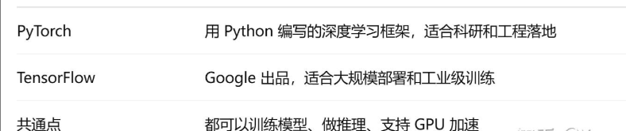
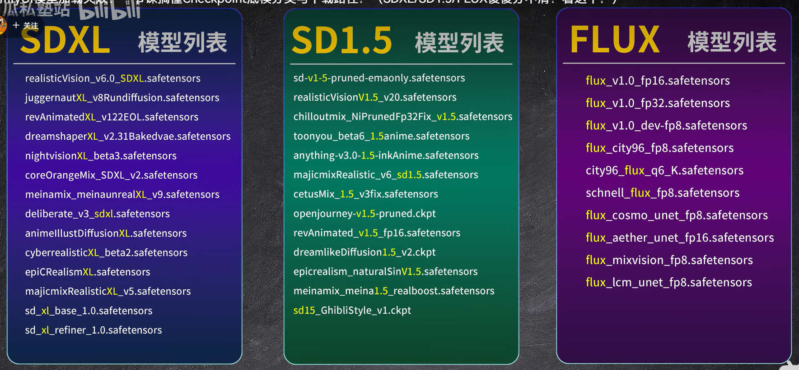
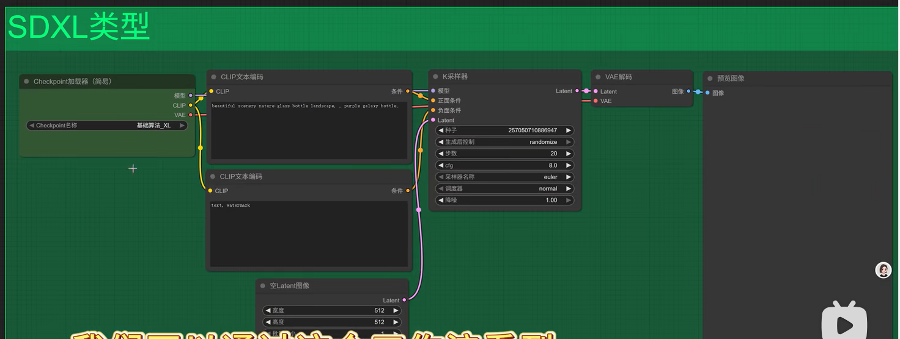
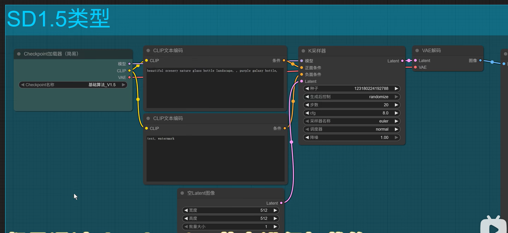
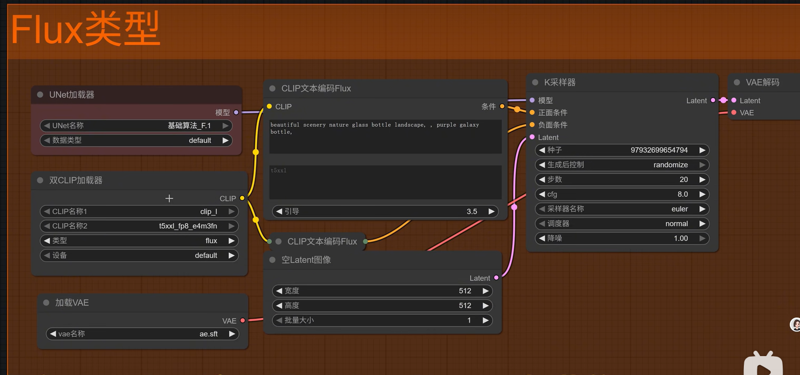
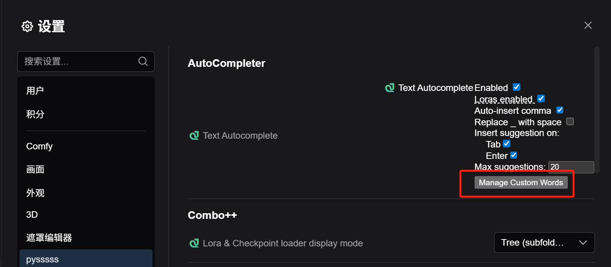
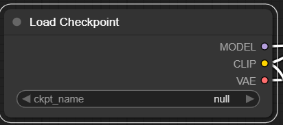
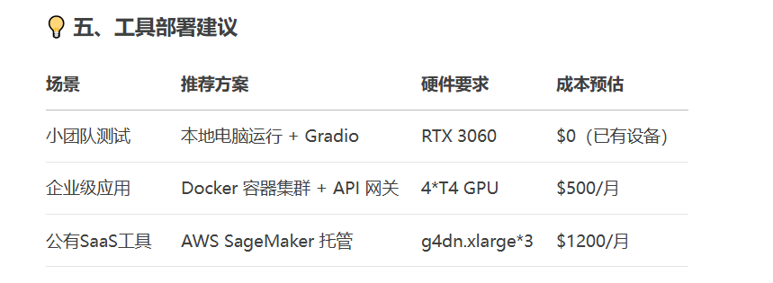
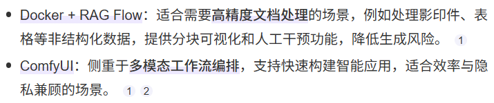

## 使用命令行创建虚拟环境 
### 框架选择 
### 使用 Python 命令 python -m venv env_name
### 使用 Anaconda 命令  conda create -p ./env_name python=3.12 # 需要指定 python 版本
### 创建完成后，其默认会在当前地址下创建环境目录，下图以 conda 为例，里面就是 python 依赖的部分运行环境文件
## 使用pycharm创建项目

### 电商项目实现思路 ComfyUI+lora 
### comfyUI 加载工作流的几种方式
### 
### 微调GPT-2生成电商文案（Hugging Face + LoRA）
### 常用的工作流 https://gf66fxi6ji.feishu.cn/wiki/UzFfwaOx3iY3ZAksErvcBbrp
### ComfyUI项目页面：github.com/comfyanonymous/ComfyUI  Examples：comfyanonymous.github.io/ComfyUI_examples
### ComfyUI模型分类

### 主要模型大模型下载途径  支持ckpt、safetensors 格式

### 下载单个节点 git clone D:\ComfyUI_windows_portable\ComfyUI\custom_nodes 
### 节点管理器ComfyUI-Manager，可以一键下载确实节点, 不用去git找完一个一个单独下载
### 输入补全ComfyUI-Custom-Scripts 添加以后需要加载保存一次
### 节点文本汉化 AIGODLIKE-ComfyUI-Translation
### 节点用中文输入描述ComfyUI_Custom_Nodes_AlekPet 空白双击Argos Translate CLlP Text Encode Node
### ComfyUI-WD14-Tagger 用 load image 反推提示词为后续节点赋能
   

