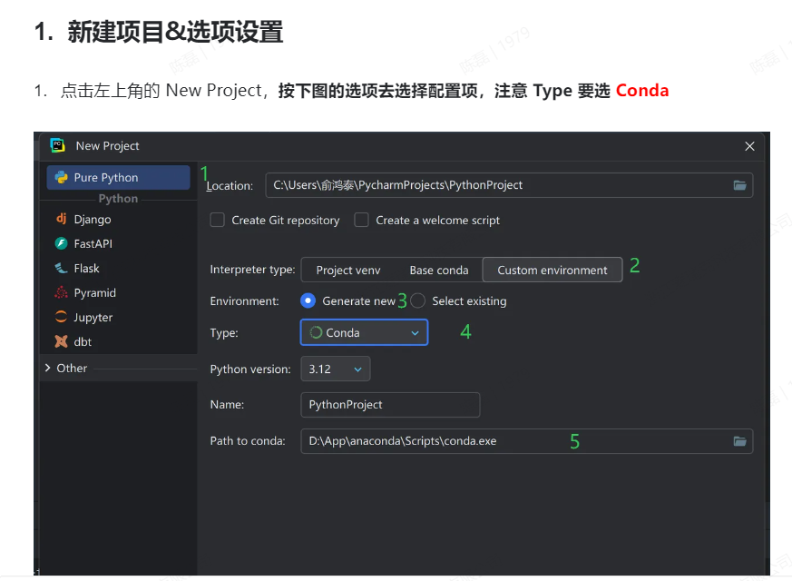
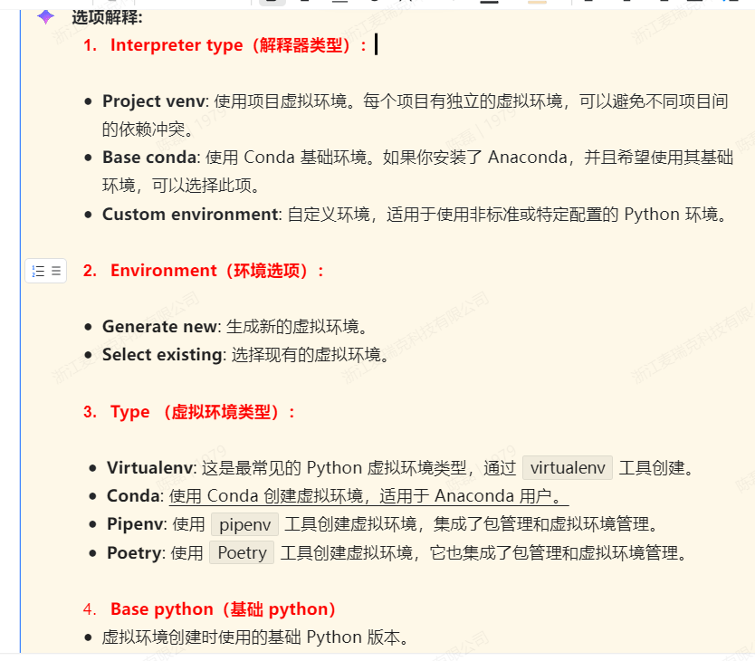
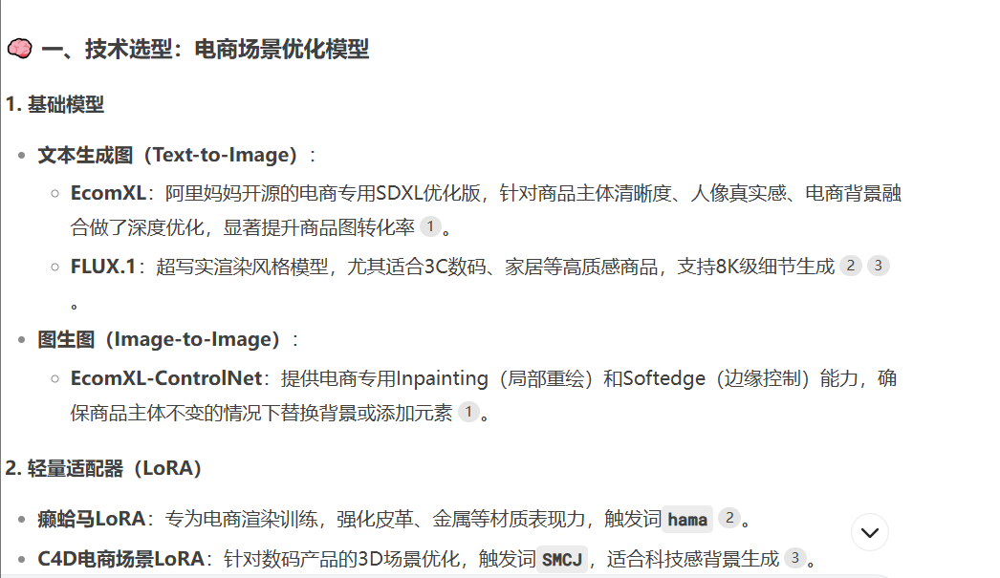
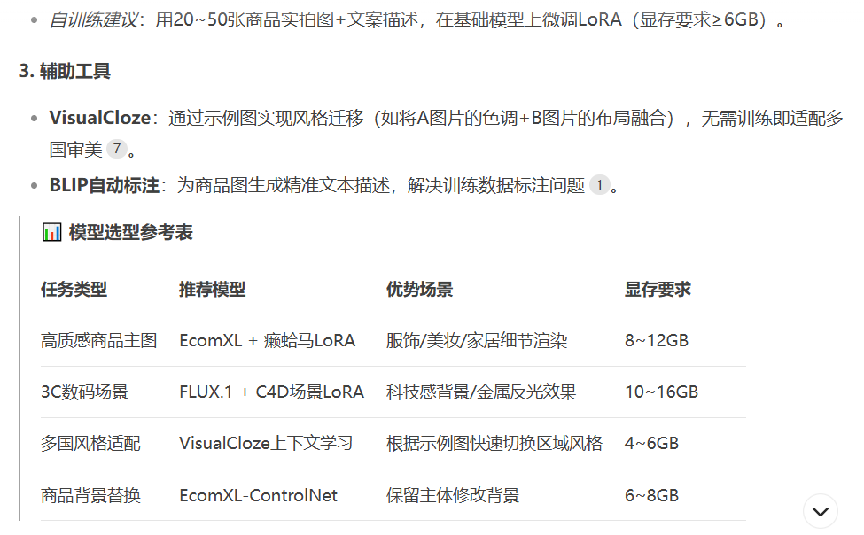
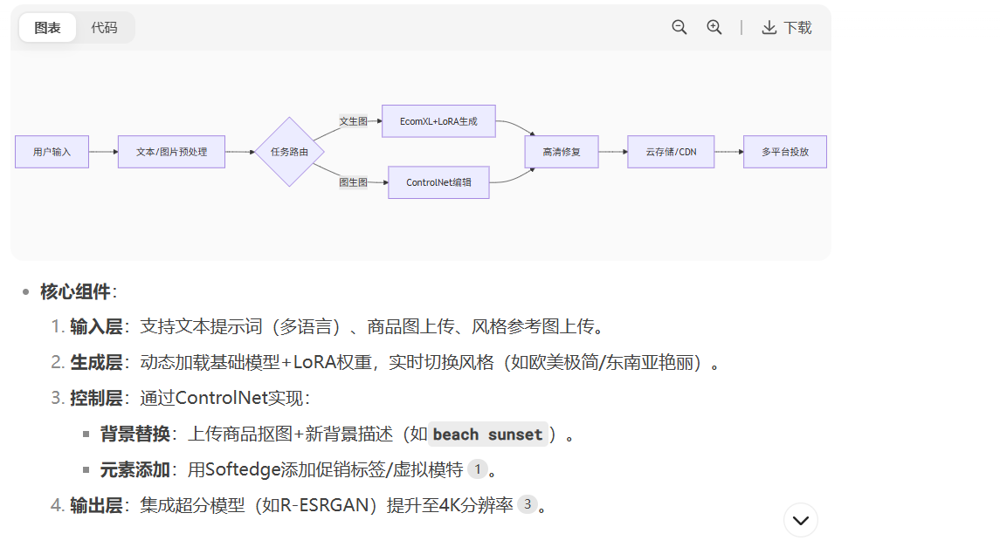
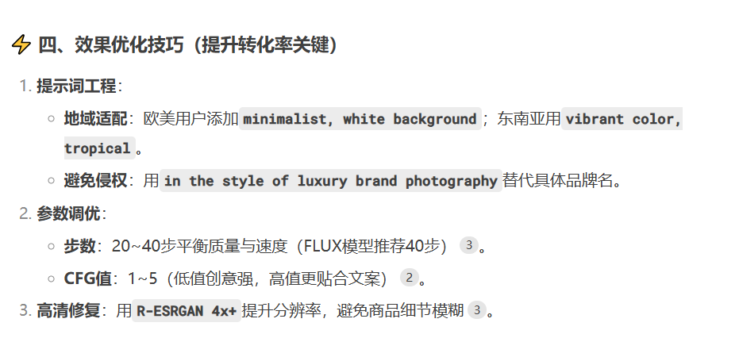
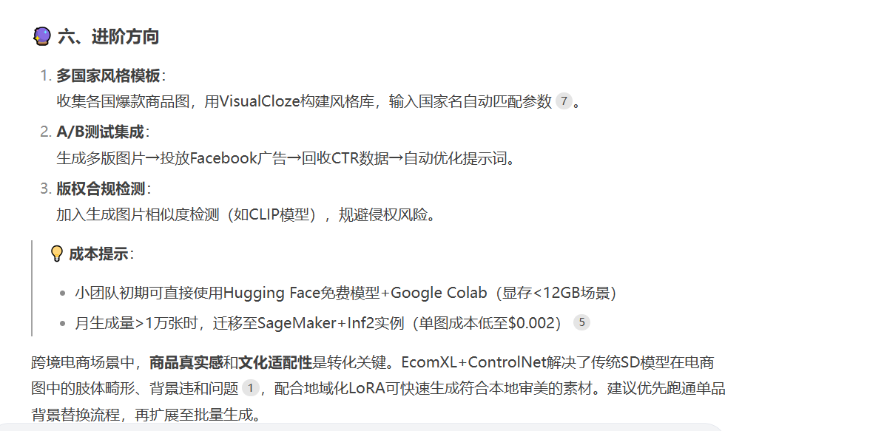

## 使用命令行创建虚拟环境 
### 使用 Python 命令 python -m venv env_name
### 使用 Anaconda 命令  conda create -p ./env_name python=3.12 # 需要指定 python 版本
### 创建完成后，其默认会在当前地址下创建环境目录，下图以 conda 为例，里面就是 python 依赖的部分运行环境文件
## 使用pycharm创建项目

### 电商项目实现思路

